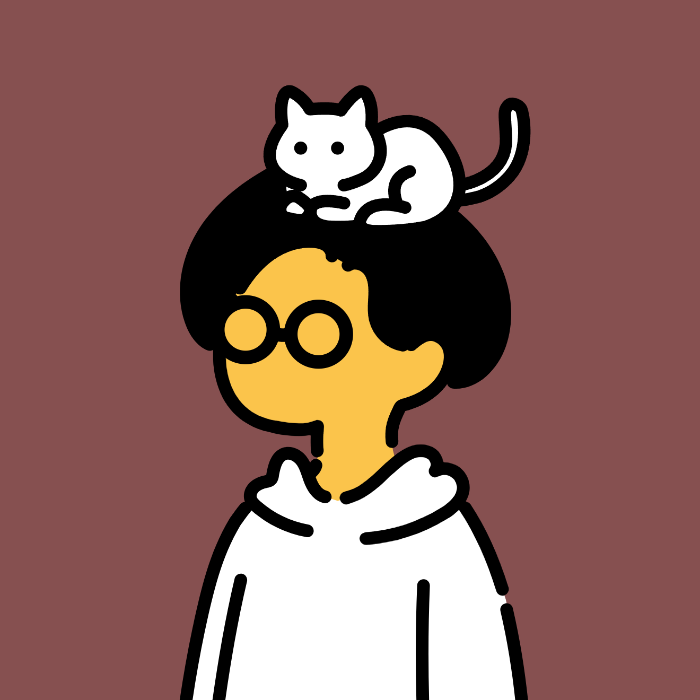

<h1>aritro shome</h1>

</img>

(self-proclaimed) neurosurgeon of ai models. performing lobotomy on VLMs and making them think visually so that they go brr. also making sure these models behave well and don't accidentally take over humanity. currently an undergrad, information technology major, scheduled to graduate in 2028 (hopefully).

- topics of interest: interpretablity, alignment and safety research, vision models, reasoning models. 
- more deets about me on my [homepage](https://aritro.is-a.dev/)
- i also have a [technical blog](https://silicognition.is-a.dev/) and a [non-technical blog](https://silicognition.substack.com/). 
- currently a research intern @ <a href="https://ai4bharat.iitm.ac.in/">ai4bharat</a>, iitmadras
- ex-intern @ <a href="https://sarvam.ai">sarvam</a> on their dubbing team

<b>tech stack</b>: python, huggingface, pytorch, numpy, pandas, wandb.

<b>how to contact me:</b>

(decreasing order of response times)

- [linkedin](https://www.linkedin.com/in/aritro-shome-40a5b0312/)
- [twitter](https://x.com/silicognition)
- [email](mailto:aritro.shome.official@gmail.com)
- [instagram](https://instagram.com/thearitroshome) 
- pigeon, but i can't doxx myself so use the above four. 
